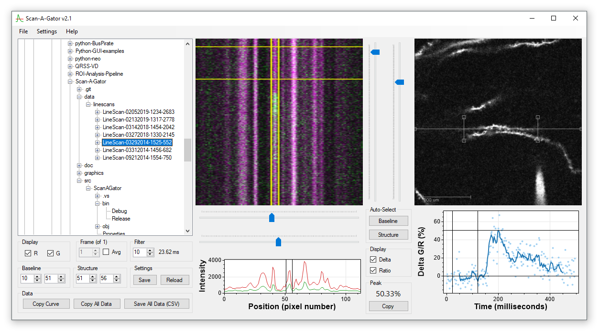

# Scan-A-Gator
**Scan-A-Gator** is a Windows application to facilitate analysis of calcium levels from ratiometric line scan images. It was created to rapidly browse and analyze folders created by Prairie View software, but can be easily adapted for other applications. This application makes use of [SciTIF](https://github.com/swharden/SciTIF) and [ScottPlot](https://github.com/swharden/ScottPlot) libraries.

## Download
A click-to-run Scan-A-Gator (zipped EXE) is available with each release:
https://github.com/swharden/Scan-A-Gator/releases/latest

## Features
* Can analyze TIFs with data of arbitrary bit depths (e.g., 12-bit data in a 16-bit TIF)
* Semi-automated analysis facilitated by configurable default settings
* Graphs are fully interactive
* Linescan data can be copied to clipboard (TSV) or saved (CSV)
* Analysis parameters for linescans can be saved/recalled as ini files
* Analytical process is fully documented and easy to review in code
* Prairie View version 4 and version 4 XML files are both supported
