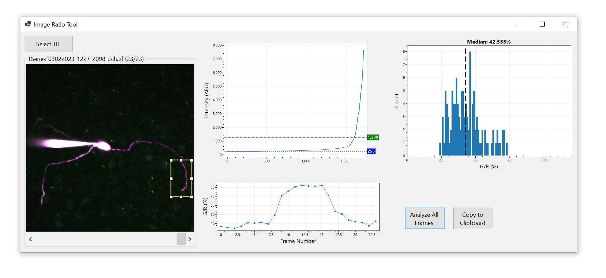

# Scan-A-Gator

**ScanAGator is a Windows application for analyzing ratiometric fluorescent imaging data.** It was created to navigate data created by Prairie View software, but it can be adapted to navigate and analyze data from other sources.

### ScanAGator
Analyzes ratiometric fluorescence over time from linescan images

### ImageRatioTool
Analyzes ratiometric properties of 2D fields of optical section and projection images

